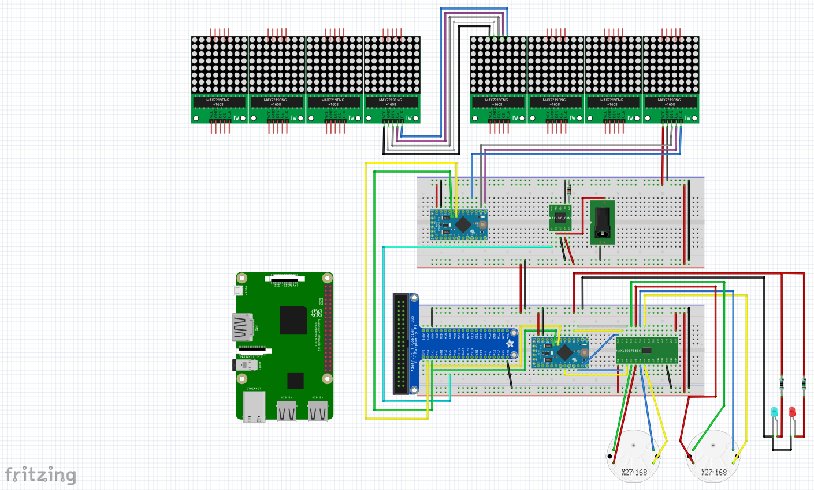

# Twitometer  

## Operation  
1. Raspberry Pi establishes a connection to Twitter Streaming API via Tweepy.  
2. Tweets are retrieved that include text that match a series of words ("Biden" "Trump").  
3. There are two Arduinos connected to the Pi. One for the LED Matrix displays and one for the two stepper motor gauges.
4. "Tweets per minute" is calculated and sent as bytes to the "stepper" Arduino via I2C.  
5. The Arduino then outputs a pulse for each microstep to a microstepping controller which is connected to two X27-168 instrumentation steppers which drive the gauge needles.  
6. Periodically the text of a tweet corresponding to a keyword (Biden or Trump) is sent to the "display" Arduino via I2C.  
7. The display Arduino sends the text over I2C to one of two corresponding MAX7219 8x32 LED matrices (blue for Biden, red for Trump).  
8. The corresponding tweet scrolls across each display.  

## Future improvements   
1. Attempt to classify tweets as "positive" or "negative" by comparison to lists of "positive" or "negative" words doesn't work very well. As a result, due to the nature of Twitter, the gauges might be best thought of as negative attention meters.   
2. Left over unused variables and code fragments need to be cleaned up.  
3. I2C communications would benefit from more robust error checking and flow control. Periodic I2C errors exist.  
4. Scrolling text sometimes appears to be garbled or truncated.  
5. If too many I2C errors occur in succession, the Pi brute force reboots the Arduinos by cycling the power.  
6. Basic de-amateurization.  

 ## Parts List
1. 1 x Raspberry Pi Model 3B+ w/ SD Card
2. 1 x USB power supply for Raspberry Pi
3. 2 x Arduino Pro Mini 5V/16Mhz
4. 1 x SparkFun DC/DC Converter Breakout (BOB-09370)
5. 1 x 1/2 Watt  1.3K ohm Carbon Comp Resistor
6. 1 x 1/2/4 SOP28 SSOP28 TSSOP28 to DIP28 0.7" Header Spacing SMD Adapter PCB Board
7. 1 x AX AX1201728SG SOP-28 Quad Microstepping Controller IC
8. 2 x X27-168 Stepper Motors
9. 2x uxcell Instrument Cluster Pointer Needle Set for HAVAL H2 (use small dia heat shrink on motor stems for friction fit)
10. 1 x DAOKI MAX7219 Dot led Matrix MCU 8x32 LED Display Module for Arduino, Blue
11. 1 x DAOKI MAX7219 Dot led Matrix MCU 8x32 LED Display Module for Arduino, Red
12. 1 x Red LED
13. 1 x 150 ohm resistor
14. 1 x Blue LED
15. 1 x 100 ohm resistor
16. Misc shrink tubing
17. Misc jumper wires
18. 1 x Adafruit Pi T-Cobbler Plus w/ ribbon cable
19. Spiral cable wrap
20. Coobl Dupont Jumper Wire Male Pin Connectors 2.54mm
21. 1 x BB400 Solderless Breadboard 
22. 1 x BB830 Solderless Breadboard

## Schematic Diagram  
